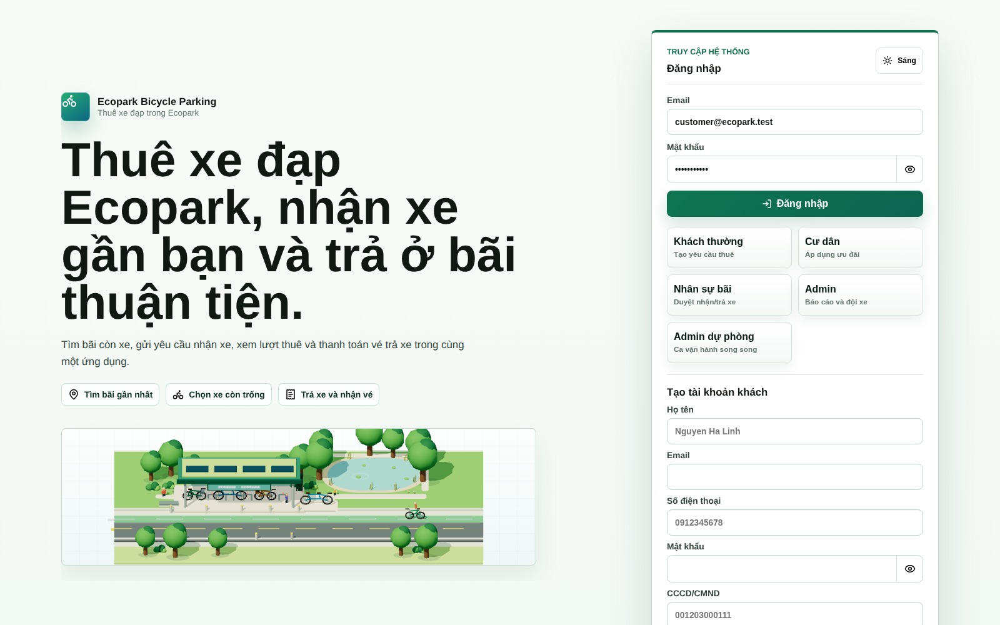
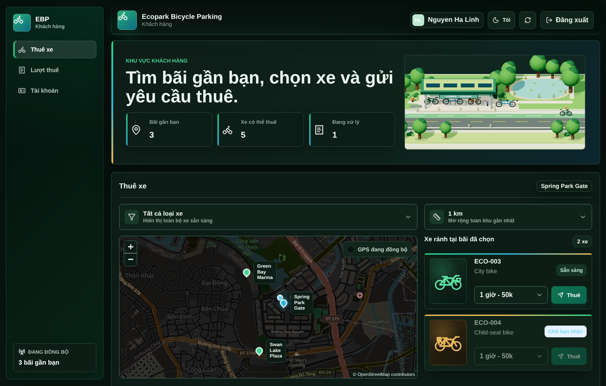
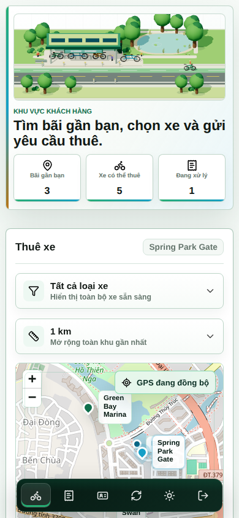
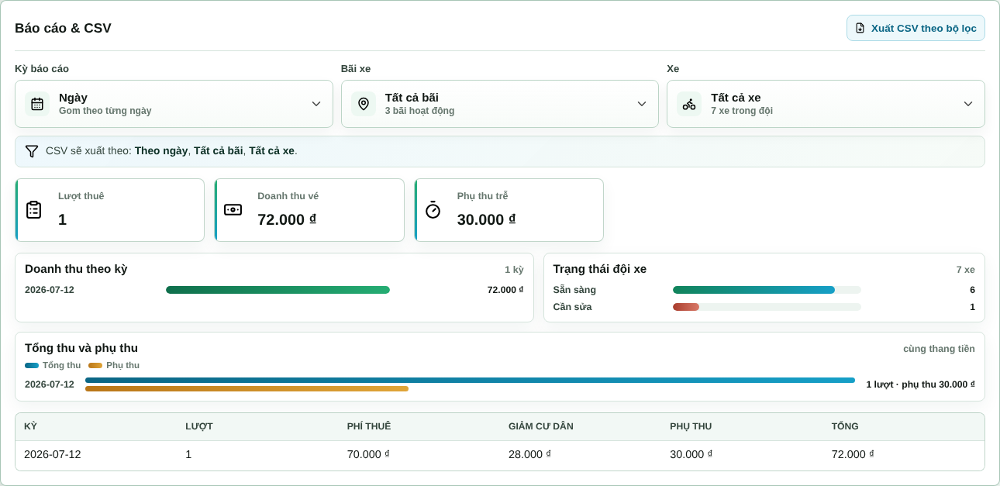

# Ecopark Bicycle Parking - Presentation

Nhánh `presentation` chỉ lưu tài liệu trình bày, PDF đã build và ảnh minh chứng
giao diện. Mã nguồn ứng dụng, server, test, CI và dependency được duy trì trên
nhánh [`main`](https://github.com/sontungkieu/2025.2-IT3180E-SE/tree/main).

Không merge nhánh này ngược vào `main`: các file runtime vắng mặt ở đây là chủ
ý, không phải yêu cầu xóa chúng khỏi sản phẩm.

## Tài liệu chính

- [`pdf/main.pdf`](pdf/main.pdf): report chính.
- [`pdf/main_app_style.pdf`](pdf/main_app_style.pdf): report theo visual style
  của ứng dụng.
- [`pdf/slides.pdf`](pdf/slides.pdf): slide thuyết trình chính.
- [`pdf/slides_app_style.pdf`](pdf/slides_app_style.pdf): slide theo visual style
  của ứng dụng.
- [`pdf/slides_en.pdf`](pdf/slides_en.pdf): slide tiếng Anh.
- [`pdf/presentation_script.md`](pdf/presentation_script.md): kịch bản trình bày.

`pdf/slide.pdf` và `pdf/slide_app_style.pdf` là các bản sao tương thích của hai
bộ slide tiếng Việt tương ứng.

## UI evidence

| Đăng nhập và scene 3D | Customer dark mode |
| --- | --- |
|  |  |

| Customer mobile | Operations dashboard |
| --- | --- |
|  |  |

## Cấu trúc nhánh

- `pdf/`: source LaTeX, PDF đã build, ảnh UI và asset sơ đồ.
- `docs/`: use-case diagram và tài liệu thiết kế liên quan.
- `milestones.md`: lịch sử kết quả tài liệu và presentation.
- `plan_next_report_submission.md`: kế hoạch nộp report hiện tại.
- `improvement_proposals_3d_ui.md`: đề xuất đánh bóng scene 3D/UI.
- `Note.md`, `report_requirements.png`: ghi chú và yêu cầu đầu vào.

## Nguồn screenshot

Không tạo screenshot từ nhánh `presentation`, vì nhánh này không giữ runtime và
không phải source of truth của UI. Luôn chụp từ commit hiện tại của `main`, kiểm
tra ảnh ở viewport cố định, sau đó mới thay asset trong
`pdf/assets/screenshots/` hoặc `pdf/assets/uc001_flow/` trên nhánh này.

Có thể mở `main` trong worktree riêng mà không rời nhánh tài liệu:

```bash
git worktree add ../ecobike-main main
cd ../ecobike-main
npm ci
npm run smoke:ui
npm run smoke:uc
```

Chuỗi ảnh UC001 có script riêng trên `main`:

```bash
npm run screenshots:uc001
```

Script tạo ảnh trong `pdf/assets/uc001_flow/` của worktree `main`; cần kiểm tra
trực quan rồi chép các PNG đạt yêu cầu sang cùng thư mục trên `presentation`.
Các ảnh auth, customer, operations, dark mode và `/gd` cũng phải được chụp từ
`main` bằng Playwright, không dùng lại code cũ từ lịch sử của nhánh tài liệu.

## Build PDF

Yêu cầu `latexmk` và bộ package LaTeX đang dùng trong các file `.tex`.

```bash
cd pdf
latexmk -pdf main.tex
latexmk -pdf main_app_style.tex
latexmk -pdf slides.tex
latexmk -pdf slides_app_style.tex
cp slides.pdf slide.pdf
cp slides_app_style.pdf slide_app_style.pdf

latexmk -c main.tex
latexmk -c main_app_style.tex
latexmk -c slides.tex
latexmk -c slides_app_style.tex
find . -maxdepth 1 -type f \( \
  -name "*.aux" -o -name "*.log" -o -name "*.out" -o -name "*.toc" -o \
  -name "*.fls" -o -name "*.fdb_latexmk" -o -name "*.synctex.gz" -o \
  -name "*.nav" -o -name "*.snm" -o -name "*.vrb" -o \
  -name "*.bbl" -o -name "*.blg" \
\) -delete
```

Sau build phải giữ source `.tex`, asset và PDF đầu ra; không commit file trung
gian LaTeX.
